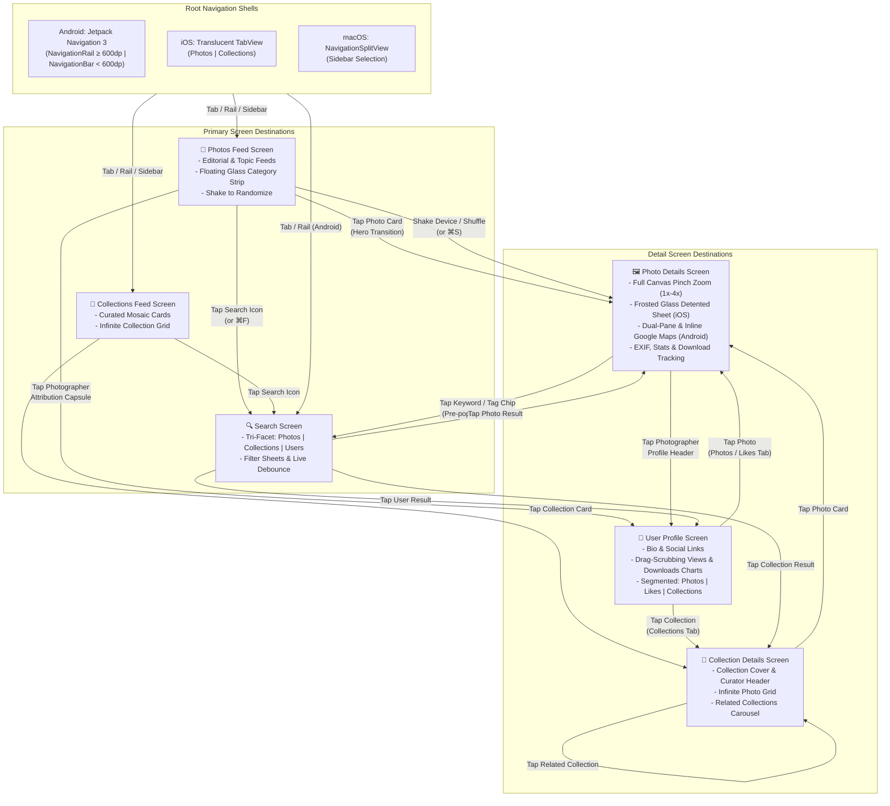

> This project is a proof of concept written entirely with recent models focused on efficiency like Google's Gemini 3.5 Flash and MAI-Code-1-Flash. The main goal was to evaluate the models and different ways to work with them (Antigravity, Gemini CLI, GitHub Copilot and so on).

# Unsplash Image Feed App (Kotlin Multiplatform)

A modern, fluid, and high-performance Kotlin Multiplatform (KMP) application utilizing the public Unsplash API to deliver a rich, responsive photo discovery experience on Android, iOS, and macOS.

---

## 📱 Project Overview

The Unsplash Image Feed App demonstrates clean, scalable multiplatform engineering by uniting a shared Kotlin Multiplatform business and presentation core with native platform UI toolkits:
* **Android**: Jetpack Compose powered by modern Material 3 design tokens, dynamic color tonal palettes, and Jetpack Navigation 3.
* **iOS**: SwiftUI (iOS 17+) featuring a frosted glass design system (`GlassTheme`), translucent chrome, interactive detented sheets, and sensory haptic feedback.
* **macOS**: Native desktop target compiling via XcodeGen with a multi-column `NavigationSplitView` sidebar, responsive grid scaling, and desktop keyboard shortcuts.

The application adheres strictly to the Unsplash API developer guidelines (hotlinking, attribution, ixid retention, download tracking) and implements a rich photo discovery experience across mobile, tablet, foldable, and desktop form factors.

---

## ✨ Features Overview

The application delivers a rich set of capabilities across six major screen destinations:

### 1. 📸 Photo Discovery & Topics Feed
* **Editorial & Topic Feeds**: Toggle between general editorial curation and specialized topic categories (e.g. Wallpapers, Nature, 3D Renders, Travel, Architecture) via an interactive horizontal pill selector.
* **Responsive Multi-Column Grids**: Dynamic column distribution that seamlessly adapts across mobile phones, foldable postures, tablets, and widescreen desktop windows.
* **BlurHash Placeholders**: Instant image decode placeholders computed from Unsplash BlurHash strings for seamless, zero-flash image load transitions.
* **Dynamic CDN Optimization**: Requests images appended with calculated container widths (`&w=`, `&q=80`, `&auto=format`), minimizing bandwidth and device RAM usage.
* **Shake-to-Shuffle**: Shake physical devices (accelerometer detector) or trigger the shuffle shortcut (⌘S / toolbar button) to discover a curated random photo.
* **Infinite Pagination & Pull-to-Refresh**: Seamless pre-fetching before reaching the bottom of the feed, paired with native pull-to-refresh mechanics on both platforms.

### 2. 🔍 Unified Multi-Facet Search
* **Real-Time Debounced Queries**: Responsive search input with debounced typing to prevent excessive API calls.
* **Tri-Facet Category Tabs**: Instant segmentation across **Photos**, **Collections**, and **Users**.
* **Filter Sheets**: Fine-tune queries with configurable sheet controls for image orientation (All, Landscape, Portrait, Squarish), primary color palette, and sort order (Relevant, Latest).
* **Clickable Tag Navigation**: Tapping any keyword tag on a photo detail view launches search with the selected query pre-filled.

### 3. 🖼️ Photo Details, EXIF & Map Inspection
* **Full-Canvas Image View & Zoom**: Pinch-to-zoom (1.0x to 4.0x) with pan gestures and double-tap zoom toggle.
* **Interactive Frosted Glass Inspector Sheet (iOS)**: Non-modal interactive detented bottom sheet (`.presentationDetents([.fraction(0.35), .fraction(0.70), .large])`) with background interaction enabling simultaneous photo inspection and metadata browsing.
* **Responsive Dual-Pane Layout (Android)**: Side-by-side photo canvas and metadata inspector deck on wide screens, tablets, and book-posture foldables (with hinge crease avoidance).
* **Inline Geolocation with Google Maps (Android)**: Visualizes image capture coordinates on an inline Google Map with custom dark-mode styling.
* **Comprehensive EXIF Specs**: Detailed camera data including Make, Model, Lens, Aperture ($f$-stop), Shutter Speed, ISO, and focal dimensions.
* **Popularity Metrics & Tracking**: Photo view counts, download numbers, like counts, and compliant Unsplash download tracking triggers.

### 4. 📁 Curated Collections
* **Mosaic Composite Cards**: Rich 3-photo preview mosaics displaying collection cover imagery, titles, photo counts, and curator attribution.
* **Collection Detail View**: Dedicated infinite photo stream for any selected collection.
* **Related Collections Carousel**: Discover contextually related photo albums at the bottom of the collection detail view.

### 5. 👤 Photographer Profiles & Analytics
* **Public Photographer Portfolio**: Profile header with avatar, bio, location, and social links.
* **Segmented Feeds**: Browse a creator's work partitioned into **Photos** (uploads), **Likes**, and curated **Collections**.
* **Interactive Trend Charts**: Dual timeline charts tracking historical Views and Downloads with touch-drag scrubbing tooltips.

### 6. 🎨 Cross-Platform Design Systems & Sensory UX
* **Android Material 3**: Full M3 tonal palettes, dynamic color support (Android 12+), semantic surface containers (`surfaceContainerLowest` through `surfaceContainerHighest`), `M3 SearchBar`, `PullToRefreshBox`, and predictive back navigation.
* **iOS Glassmorphism**: `GlassTheme` material system with `.ultraThinMaterial`, floating glass category capsules, floating glass attribution chips, iOS 17 `.scrollTransition` scale/opacity dynamics, and declarative `.sensoryFeedback`.
* **Fluid Motion & Shared Transitions**: Hero transitions via `matchedGeometryEffect` (iOS) and `SharedTransitionLayout` (Android), staggered grid entrance animations, and springy press-scale feedback.

---

## 🗺️ Screen Navigation Architecture

The app uses a unified, cross-linked navigation model where users can navigate smoothly from any entity (photo, collection, curator, tag) to its associated screens.

### Navigation Hierarchy Diagram



### Navigation Architecture Details

* **Android Navigation 3 (`NavBackStack` + `NavDisplay`)**:
  * Type-safe, sealed route hierarchy: `Screen.Feed`, `Screen.Collections`, `Screen.CollectionDetails(collectionId)`, `Screen.Search(query)`, `Screen.PhotoDetails(photoId)`, `Screen.UserProfile(username)`.
  * Responsive navigation container: Start-docked `NavigationRail` with quick-shuffle access on Medium/Expanded displays ($\ge 600\text{dp}$), switching to a bottom `NavigationBar` on compact screens (< 600dp).
  * Smooth entry transitions wrapped in `SharedTransitionLayout` for hero photo expansion.
* **iOS & macOS SwiftUI Navigation (`NavigationStack`)**:
  * Typed path back stacks using `FeedPathItem` and `CollectionPathItem` enums.
  * Translucent glass `TabView` on iOS with `.toolbarBackground(.ultraThinMaterial, for: .tabBar)`.
  * Native `NavigationSplitView` master-detail sidebar layout on macOS.
  * Interactive hero card zoom transitions powered by `matchedGeometryEffect`.

---

## 🏗️ Technical Architecture

The codebase follows the **Shared Presenter Pattern**, maximizing cross-platform code reuse while retaining completely native rendering and scrolling performance.

```
┌─────────────────────────────────────────────────────────────────────────────┐
│                             App View Shells                                 │
│                                                                             │
│   ┌───────────────────────────────┐         ┌───────────────────────────┐   │
│   │   androidApp (Jetpack Compose)│         │     iosApp (SwiftUI)      │   │
│   │   - Material 3 Design Tokens  │         │   - Glassmorphic Design   │   │
│   │   - Jetpack Navigation 3      │         │   - NavigationStack       │   │
│   │   - Adaptive Rail & Dual-Pane │         │   - Detented Sheets       │   │
│   │   - Google Maps Integration   │         │   - iOS & macOS Targets   │   │
│   └───────────────┬───────────────┘         └─────────────┬─────────────┘   │
└───────────────────┼───────────────────────────────────────┼─────────────────┘
                    │ (Collects StateFlow)                  │ (Observes CommonFlow)
                    ▼                                       ▼
┌─────────────────────────────────────────────────────────────────────────────┐
│                    shared Module (Kotlin Multiplatform)                     │
│                                                                             │
│   ┌─────────────────────────────────────────────────────────────────────┐   │
│   │                             Presenters                              │   │
│   │  (FeedPresenter, UnifiedSearchPresenter, PhotoDetailsPresenter,     │   │
│   │   CollectionDetailPresenter, UserProfilePresenter)                  │   │
│   │   * PresenterScope Lifecycle Management & updateIfActive Guard      │   │
│   └──────────────────────────────────┬──────────────────────────────────┘   │
│                                      ▼                                      │
│   ┌─────────────────────────────────────────────────────────────────────┐   │
│   │               Metro Compile-Time Dependency Injection               │   │
│   │         (@DependencyGraph, @Inject, @AssistedFactory)               │   │
│   └──────────────────────────────────┬──────────────────────────────────┘   │
│                                      ▼                                      │
│   ┌─────────────────────────────────────────────────────────────────────┐   │
│   │                         UnsplashRepository                          │   │
│   └──────────────────────────────────┬──────────────────────────────────┘   │
│                                      ▼                                      │
│   ┌─────────────────────────────────────────────────────────────────────┐   │
│   │                         UnsplashApiClient                           │   │
│   │          (Ktor 3.5 HTTP Engine, ContentNegotiation, Json)           │   │
│   └──────────────────────────────────┬──────────────────────────────────┘   │
│                                      ▼                                      │
│   ┌─────────────────────────────────────────────────────────────────────┐   │
│   │              BuildKonfig (Compile-Time Config Injection)            │   │
│   └─────────────────────────────────────────────────────────────────────┘   │
└─────────────────────────────────────────────────────────────────────────────┘
```

* **`shared` (`commonMain`, `appleMain`, `androidMain`)**:
  * **Compile-Time DI**: Fast, reflection-free dependency injection with **Metro** (`dev.zacsweers.metro`).
  * **Lifecycle-Safe Presenters**: Presenters own managed `PresenterScope` instances with clean `clear()` lifecycles, guarded by `updateIfActive()` helpers to prevent memory leaks or emissions after screen teardown.
  * **Networking**: High-performance HTTP client using Ktor 3.5 with Darwin engine for Apple targets and OkHttp engine for Android.
* **`androidApp`**: Pure Jetpack Compose UI shell with Navigation 3, Coil 3.5 image pipeline, Google Maps Compose, and Material 3 design tokens.
* **`iosApp`**: Pure SwiftUI shell observing shared Kotlin flows into Swift 5.9+ `@Observable` view models, supporting iOS 17+ and macOS 14+ targets.

---

## 🔑 API Keys & Configuration

To comply with security best practices, the application loads API credentials from local, git-ignored configuration files at compile time.

### 1. Unsplash API Client Access Key
1. Create a `local.properties` file in the root directory (if not already present):
   ```bash
   touch local.properties
   ```
2. Add your Unsplash Access Key:
   ```properties
   unsplash.api.key=YOUR_UNSPLASH_ACCESS_KEY_HERE
   ```
   `BuildKonfig` automatically injects this property into the shared module during compilation (`BuildKonfig.UNSPLASH_API_KEY`).

### 2. Google Maps API Key (Android Geolocation)
To render inline Google Maps in Android's Photo Details screen:
1. Append your Google Maps SDK key to `local.properties`:
   ```properties
   google.maps.api.key=YOUR_GOOGLE_MAPS_API_KEY_HERE
   ```
   Gradle injects this key into the Android Manifest placeholders at build time.

---

## 🛠️ Development Workflow

This project adheres to a strict spec-driven engineering workflow:
* **Specs & Planning**: Every change is anchored in a specification document in `specs/`. Check `specs/steps.md` for historical implementation notes.
* **Zero Warning Policy**: Code changes must produce zero compiler warnings and clean lint reports.
* **Dual-Platform Build Policy**: Any change affecting `shared/` or platform logic must be verified on both Android and iOS targets.
* **Architecture Rules**: Review `AGENTS.md` and the rule sets in `ai-rules/` for guidelines on presenter lifecycles, cross-language interop, and UI styling.

---

## 🚀 How to Build and Run

### 📋 Prerequisites
* **macOS** (Required to compile the iOS and macOS native targets)
* **Android Studio Ladybug / Koala+** with the **Kotlin Multiplatform Mobile** plugin
* **Xcode 15+ / 16+**
* **JDK 17** or newer
* **XcodeGen** (`brew install xcodegen`)

### 🤖 Running the Android Application
1. Open the project folder in **Android Studio**.
2. Allow Gradle to sync dependencies.
3. Select `androidApp` in the run configuration dropdown.
4. Launch on an Android Emulator (API 29+) or connected physical device.

Command-line build:
```bash
./gradlew :androidApp:assembleDebug
```

### 🍎 Running the iOS Application
The shared KMP framework compiles for iOS device and simulator architectures (`iosArm64`, `iosSimulatorArm64`).

1. Generate the Xcode project:
   ```bash
   cd iosApp && xcodegen
   ```
2. Open `iosApp/iosApp.xcodeproj` in **Xcode**.
3. Select the `iosApp` scheme and an iOS Simulator (iPhone 15+ / iOS 17+).
4. Build and run with **⌘R**.

Command-line simulator compilation:
```bash
./gradlew :shared:compileKotlinIosSimulatorArm64
```

### 💻 Running the macOS Application
The macOS desktop app shares the same codebase and Xcode project:
1. Open `iosApp/iosApp.xcodeproj` in **Xcode**.
2. Select the `macosApp` scheme in the top toolbar.
3. Build and run with **⌘R**.

### 🧪 Testing & Verification
Execute the shared multiplatform integration and package-level test suite:
```bash
./gradlew :shared:allTests
```

### 🧹 Code Quality & Static Analysis
Run project linters before submitting changes:
```bash
# Kotlin linting & static analysis
./gradlew ktlintCheck detekt

# Automatically format Kotlin code
./gradlew ktlintFormat

# Swift linting & formatting
swiftlint lint iosApp/iosApp
swiftformat --lint .
```

---

## 📜 Unsplash API Compliance Guidelines

When modifying views or business logic, always follow the Unsplash API developer requirements:
* **Direct Hotlinking**: Never cache or host Unsplash image files on intermediate third-party servers. Display photos utilizing direct URLs returned by the Unsplash API.
* **Parameter Preservation**: Preserve all `ixid` tracking parameters in image request query strings.
* **Photographer Attribution**: Display photographer names and profile pictures prominently, including clickable links back to their Unsplash profile with UTM referral tracking parameters (`utm_source=ImageFeedApp&utm_medium=referral`).
* **Download Tracking**: Ensure that photo download and save actions trigger the designated `photo.links.download_location` endpoint.
