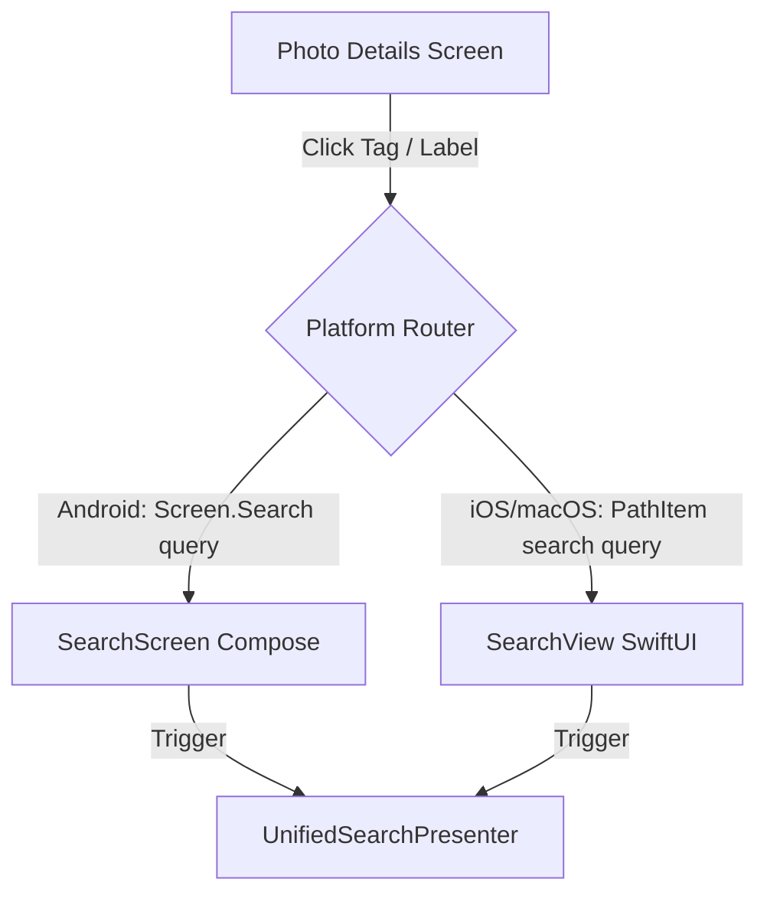

# Implementation Step 16: Clickable Image Labels Navigation

This specification outlines the architecture, data flow, and code modifications required to make image tags/labels clickable. When clicked, the application will navigate to the search screen and automatically perform a search using the selected label as the search query.

---

## 1. Overview & Architectural Design

Currently, the application displays tags (under the label "RELATED TAGS") at the bottom of the photo detail view. These tags are static labels. 
To implement navigation from these tags to search:
1. **Shared Presentation Layer:** The `UnifiedSearchPresenter` already provides a public `updateQuery(newQuery: String)` method that resets pagination and performs a search. We do not need to modify the shared module.
2. **Android UI (Compose & Nav3):** 
   - `Screen.Search` must be changed from a `data object` to a `data class Screen.Search(val query: String = "")` to carry the tag name to the Search screen.
   - `PhotoDetailsScreen` will accept a new callback `onTagClick: (String) -> Unit`.
   - `SearchScreen` will accept an `initialQuery: String` parameter and trigger the search using a `LaunchedEffect(initialQuery)`.
3. **iOS/macOS UI (SwiftUI):**
   - `PhotoDetailsView` will accept a new callback `onTagSelect: (String) -> Void`.
   - `SearchView` will accept an `initialQuery: String` parameter, which it uses to initialize the search text state and trigger the query via the `SearchViewModel`.
   - The navigation path elements (`FeedPathItem` and `CollectionPathItem`) will utilize their existing `id` field to carry the search query when navigating to `.search`.

---

## 2. Technical Modifications & Files Impacted



### 2.1 Android Target Configuration

#### 1. Define Route arguments in `MainActivity.kt`
Modify `Screen` sealed class to accept an optional `query` parameter for the search route:
```diff
-    @Serializable
-    data object Search : Screen()
+    @Serializable
+    data class Search(val query: String = "") : Screen()
```

#### 2. Pass query and handle transitions in `MainActivity.kt`
Update the bottom navigation bar and navigation entry mapping for `Screen.Search`:
```diff
                                     NavigationBarItem(
-                                        selected = currentScreen is Screen.Search,
+                                        selected = currentScreen is Screen.Search,
                                         onClick = {
                                             if (currentScreen !is Screen.Search) {
-                                                navigateToTab(Screen.Search)
+                                                navigateToTab(Screen.Search())
                                             }
                                         },
...
-                                    is Screen.Search -> NavEntry(key) {
-                                        SearchScreen(
-                                            onBack = {
-                                                if (backStackState.size > 1) {
-                                                    backStackState.removeAt(backStackState.size - 1)
-                                                }
-                                            },
-                                            onPhotoClick = { photo ->
-                                                backStackState.add(Screen.PhotoDetails(photo.id))
-                                            },
-                                            onUserClick = { user ->
-                                                backStackState.add(Screen.UserProfile(user.username))
-                                            }
-                                        )
-                                    }
+                                    is Screen.Search -> NavEntry(key) {
+                                        SearchScreen(
+                                            initialQuery = key.query,
+                                            onBack = {
+                                                if (backStackState.size > 1) {
+                                                    backStackState.removeAt(backStackState.size - 1)
+                                                }
+                                            },
+                                            onPhotoClick = { photo ->
+                                                backStackState.add(Screen.PhotoDetails(photo.id))
+                                            },
+                                            onUserClick = { user ->
+                                                backStackState.add(Screen.UserProfile(user.username))
+                                            }
+                                        )
+                                    }
```

Also, update `Screen.PhotoDetails` destination:
```diff
                                     is Screen.PhotoDetails -> NavEntry(key) {
                                         PhotoDetailsScreen(
                                             photoId = key.photoId,
                                             onBack = {
                                                 if (backStackState.size > 1) {
                                                     backStackState.removeAt(backStackState.size - 1)
                                                 }
                                             },
                                             onUserClick = { username ->
                                                 backStackState.add(Screen.UserProfile(username))
-                                            }
+                                            },
+                                            onTagClick = { tag ->
+                                                backStackState.add(Screen.Search(query = tag))
+                                            }
                                         )
                                     }
```

#### 3. Update callbacks in `PhotoDetailsScreen.kt`
```diff
 fun PhotoDetailsScreen(
     photoId: String,
     onBack: () -> Unit,
-    onUserClick: (String) -> Unit
+    onUserClick: (String) -> Unit,
+    onTagClick: (String) -> Unit
 ) {
...
                     FlowRow(
                         modifier = Modifier.fillMaxWidth(),
                         horizontalArrangement = Arrangement.spacedBy(8.dp),
                         verticalArrangement = Arrangement.spacedBy(8.dp)
                     ) {
                         tags.forEach { tag ->
                             Box(
                                 modifier = Modifier
                                     .background(Color(0xFF22222A), RoundedCornerShape(16.dp))
+                                    .clickable { onTagClick(tag.title) }
                                     .padding(horizontal = 12.dp, vertical = 6.dp)
                             ) {
```

#### 4. Handle initial query in `SearchScreen.kt`
```diff
 @OptIn(ExperimentalMaterial3Api::class)
 @Composable
 fun SearchScreen(
+    initialQuery: String = "",
     onBack: () -> Unit,
     onPhotoClick: (Photo) -> Unit,
     onUserClick: (User) -> Unit
 ) {
     val context = LocalPlatformContext.current
     val presenter = remember { KoinHelper.getUnifiedSearchPresenter() }
     val state by presenter.state.collectAsStateWithLifecycle(initialValue = SearchState())
     var showFiltersSheet by remember { mutableStateOf(false) }
 
+    LaunchedEffect(initialQuery) {
+        if (initialQuery.isNotEmpty()) {
+            presenter.updateQuery(initialQuery)
+        }
+    }
```

---

### 2.2 iOS & macOS Target Configuration

#### 1. Add Query Property to `SearchViewModel.swift`
Update initializer to receive and set the query if it is not empty:
```diff
     private let presenter: UnifiedSearchPresenter
     private var closeable: Closeable?
 
-    init() {
+    init(initialQuery: String = "") {
         let presenter = KoinHelper.shared.getUnifiedSearchPresenter()
         self.presenter = presenter
 
+        if !initialQuery.isEmpty {
+            presenter.updateQuery(newQuery: initialQuery)
+        }
+
         self.closeable = presenter.iosState.watch { [weak self] state in
```

#### 2. Update `SearchView.swift` to Synchronize Text
Create custom initializer that synchronizes Swift's internal searchable binding state (`searchText`) with the initial query:
```diff
 struct SearchView: View {
     #if os(iOS)
     @Environment(\.horizontalSizeClass) var sizeClass
     #endif
-    @State private var viewModel = SearchViewModel()
+    @State private var viewModel: SearchViewModel
     @State private var showFilters = false
-    @State private var searchText = ""
+    @State private var searchText: String
     @FocusState private var isSearchFocused: Bool
 
     let onPhotoSelect: (String) -> Void
     let onUserSelect: (String) -> Void
 
+    init(initialQuery: String = "", onPhotoSelect: @escaping (String) -> Void, onUserSelect: @escaping (String) -> Void) {
+        self.onPhotoSelect = onPhotoSelect
+        self.onUserSelect = onUserSelect
+        self._searchText = State(initialValue: initialQuery)
+        self._viewModel = State(initialValue: SearchViewModel(initialQuery: initialQuery))
+    }
```

#### 3. Update `PhotoDetailsView.swift` to handle tap actions
```diff
 struct PhotoDetailsView: View {
     let photoId: String
     let onUserSelect: (String) -> Void
+    let onTagSelect: (String) -> Void
     @State private var viewModel: PhotoDetailsViewModel
     @Environment(\.dismiss) private var dismiss
 
-    init(photoId: String, onUserSelect: @escaping (String) -> Void) {
+    init(photoId: String, onUserSelect: @escaping (String) -> Void, onTagSelect: @escaping (String) -> Void) {
         self.photoId = photoId
         self.onUserSelect = onUserSelect
+        self.onTagSelect = onTagSelect
         self._viewModel = State(initialValue: PhotoDetailsViewModel(photoId: photoId))
     }
```

Make tag badges clickable buttons:
```diff
                                         FlowLayout(spacing: 8) {
                                             ForEach(tags, id: \.title) { tag in
-                                                Text(tag.title.uppercased())
-                                                    .font(.system(size: 10, weight: .bold))
-                                                    .foregroundColor(.white)
-                                                    .padding(.horizontal, 10)
-                                                    .padding(.vertical, 6)
-                                                    .background(Color.white.opacity(0.12))
-                                                    .cornerRadius(14)
+                                                Button(action: {
+                                                    onTagSelect(tag.title)
+                                                }) {
+                                                    Text(tag.title.uppercased())
+                                                        .font(.system(size: 10, weight: .bold))
+                                                        .foregroundColor(.white)
+                                                        .padding(.horizontal, 10)
+                                                        .padding(.vertical, 6)
+                                                        .background(Color.white.opacity(0.12))
+                                                        .cornerRadius(14)
+                                                }
+                                                .buttonStyle(PlainButtonStyle())
                                             }
                                         }
```

#### 4. Update Navigation Path Mapping in `ContentView.swift`
Map the `.search` path type to construct the search view using `item.id` as the initial query parameter, and provide `onTagSelect` on `PhotoDetailsView` mappings:
```diff
             .navigationDestination(for: CollectionPathItem.self) { item in
                 switch item.type {
...
                 case .photo:
-                    PhotoDetailsView(photoId: item.id) { username in
-                        path.append(CollectionPathItem(id: username, type: .user))
-                    }
+                    PhotoDetailsView(
+                        photoId: item.id,
+                        onUserSelect: { username in
+                            path.append(CollectionPathItem(id: username, type: .user))
+                        },
+                        onTagSelect: { tag in
+                            path.append(CollectionPathItem(id: tag, type: .search))
+                        }
+                    )
...
                 case .search:
                     SearchView(
+                        initialQuery: item.id,
                         onPhotoSelect: { photoId in
                             path.append(CollectionPathItem(id: photoId, type: .photo))
                         },
                         onUserSelect: { username in
                             path.append(CollectionPathItem(id: username, type: .user))
                         }
                     )
```
*(Perform exact matching modifications to the counterpart `FeedPathItem` configurations inside `PhotosFeedTabView`).*

---

## 3. Verification Plan
- **Android:** Build and run the android target. Open a photo, scroll down to the related tags, tap a tag, verify it pushes `Screen.Search` and searches for the correct string.
- **iOS/macOS:** Build and run the iOS/macOS target. Open a photo detail view, tap a tag badge, and verify it navigates to the SearchView with the search bar pre-populated and showing active results.
