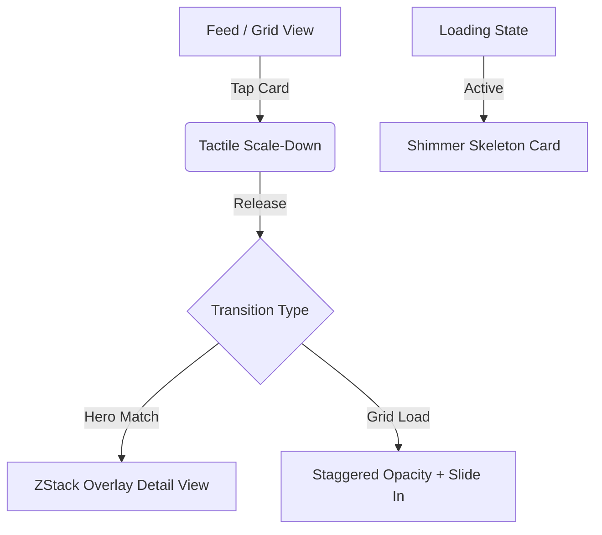

# Specification 21: iOS SwiftUI Fluid Animations Plan

This specification outlines the technical design, architectural patterns, and exact code modifications required to implement highly polished, fluid animations within the iOS SwiftUI client. The plan covers shared hero transitions, staggered grid loading, responsive tactile touch interactions, and shimmering skeleton placeholders.

---

## 1. Overview & Architectural Design

A fluid, high-frame-rate user experience is critical for a media-rich application. To elevate the visual feel of the iOS application to match Apple's modern platform standards (Human Interface Guidelines), we will introduce four primary animation systems:

1. **Hero Transitions (Shared Element Zoom)**: Connect photo thumbnails in feeds and grids directly to the hero header in the details screen.
2. **Staggered Grid Reveals**: Smoothly cascade grid items from bottom to top as they load, avoiding sudden pop-ins.
3. **Interactive Spring Card Scales**: Shrink card assets on touch-down and spring them back on release, establishing a responsive tactile response.
4. **Shimmer Skeletons**: Replace the generic `ProgressView` loaders with layout-matching content skeletons that shimmer, maintaining contextual layout during network requests.



---

## 2. Animation Systems - Technical Specifications

### 2.1 Hero Transitions with MatchedGeometryEffect

#### The NavigationStack vs. MatchedGeometry Conflict
In SwiftUI, a standard `NavigationStack` push transition slides the new screen in from the right. This system-level transition overrides and clips custom shared element transitions like `.matchedGeometryEffect`. 

To achieve a true "fluid zoom" transition where the image expands directly from its coordinate position on the grid to the top of the detail screen, we will implement **Overlay-Based Presentation** as the primary paradigm.

#### Technical Implementation
We define a shared `@Namespace` at the root/parent view level and conditionally render the detail view as an overlay on top of the tab container.

1. **Root Overlay State (`ContentView.swift` / `PhotosFeedTabView`)**:
   Add states to control hero selection:
   ```swift
   @Namespace private var heroNamespace
   @State private var selectedPhotoForHero: Photo? = nil
   @State private var showHeroDetails = false
   ```

2. **Thumbnail Image Card (`PhotoCard` inside `ContentView.swift`)**:
   Apply `.matchedGeometryEffect` using the photo's unique identifier. Ensure `isSource: true` on the grid and false on the detail screen:
   ```swift
   KFImage(URL(string: imageUrl))
       .matchedGeometryEffect(id: "photo-img-\(photo.id)", in: heroNamespace, isSource: selectedPhotoForHero?.id != photo.id)
       .clipShape(RoundedRectangle(cornerRadius: showHeroDetails && selectedPhotoForHero?.id == photo.id ? 0 : 12))
   ```

3. **Detail View Header (`PhotoDetailsView.swift`)**:
   Bind the detail view close gesture to animate the dismissal, which automatically shrinks the image back to its exact grid location:
   ```swift
   // Inside PhotoDetailsView body
   GeometryReader { geo in
       let aspectRatio = CGFloat(photo.width) / CGFloat(photo.height)
       KFImage(URL(string: imageUrl))
           .resizable()
           .aspectRatio(aspectRatio, contentMode: .fill)
           .matchedGeometryEffect(id: "photo-img-\(photo.id)", in: heroNamespace, isSource: false)
           .frame(width: geo.size.width, height: geo.size.height)
   }
   ```

To trigger:
```swift
withAnimation(.spring(response: 0.45, dampingFraction: 0.82)) {
    selectedPhotoForHero = photo
    showHeroDetails = true
}
```

---

### 2.2 Staggered Grid Reveal Transitions

When new photos or collections load in the feed, we want them to enter the screen with a cascaded bottom-up fade-in transition instead of appearing abruptly.

#### Technical Implementation
Create a reusable view modifier `StaggeredRevealModifier` that receives the cell index and delays its entrance animation proportionally:

```swift
struct StaggeredRevealModifier: ViewModifier {
    let index: Int
    @State private var isVisible = false

    func body(content: Content) -> some View {
        content
            .opacity(isVisible ? 1.0 : 0.0)
            .offset(y: isVisible ? 0 : 35)
            .onAppear {
                // Cap index-based delay calculation at 8 to prevent extreme lag for large scroll jumps
                let staggerDelay = Double(index % 8) * 0.045
                withAnimation(.spring(response: 0.48, dampingFraction: 0.82).delay(staggerDelay)) {
                    isVisible = true
                }
            }
    }
}

extension View {
    func staggeredReveal(index: Int) -> some View {
        modifier(StaggeredRevealModifier(index: index))
    }
}
```

#### Application Strategy
Apply the modifier to cards inside column loops in `ContentView.swift`, `CollectionsFeedView.swift`, `CollectionDetailView.swift`, `UserProfileView.swift`, and `SearchView.swift`. The index is derived from the flattened position of the item in the model's collection.

---

### 2.3 Interactive Spring Card Scales

Tactile feedback on touch-down provides a satisfying, highly responsive experience.

#### ButtonStyle vs. DragGesture for ScrollViews
Using a simple `DragGesture(minimumDistance: 0)` to scale cards interferes with `ScrollView` vertical scrolling because it intercepts the touch events. To avoid scrolling locks, the **ButtonStyle approach** is mathematically superior. SwiftUI's `ButtonStyle` native engine allows standard touch-down scale feedback while fully propagating drag events to the parent `ScrollView`.

#### Technical Implementation
Define a shared `SpringCardButtonStyle` that reacts dynamically to the standard `isPressed` boolean:

```swift
struct SpringCardButtonStyle: ButtonStyle {
    func makeBody(configuration: Configuration) -> some View {
        configuration.label
            .scaleEffect(configuration.isPressed ? 0.95 : 1.0)
            .animation(.spring(response: 0.22, dampingFraction: 0.72, blendDuration: 0), value: configuration.isPressed)
    }
}
```

#### Application Strategy
Wrap cards inside scroll grids with standard native `Button` elements styled with our spring button style:
```swift
Button(action: { onSelect(photo.id) }) {
    PhotoCard(...)
}
.buttonStyle(SpringCardButtonStyle())
```

---

### 2.4 Shimmer Loading Skeletons

We will implement custom shimmering layout card skeletons that replicate the look of genuine cards. This replaces the generic spinner overlays, preserving layout structural hierarchy.

#### Technical Implementation
We create a reusable `.shimmer()` modifier using an animating `LinearGradient` mask offset infinitely:

```swift
struct ShimmerModifier: ViewModifier {
    @State private var phase: CGFloat = -1.0
    let duration: Double = 1.4

    func body(content: Content) -> some View {
        content
            .overlay(
                GeometryReader { geo in
                    LinearGradient(
                        stops: [
                            .init(color: .clear, location: 0.3),
                            .init(color: .white.opacity(0.12), location: 0.5),
                            .init(color: .clear, location: 0.7)
                        ],
                        startPoint: .topLeading,
                        endPoint: .bottomTrailing
                    )
                    .rotationEffect(.degrees(20))
                    .offset(x: phase * geo.size.width * 1.5)
                    .frame(width: geo.size.width, height: geo.size.height)
                }
                .mask(content)
            )
            .onAppear {
                withAnimation(.linear(duration: duration).repeatForever(autoreverses: false)) {
                    phase = 1.0
                }
            }
    }
}

extension View {
    func shimmer() -> some View {
        modifier(ShimmerModifier())
    }
}
```

#### Skeleton Views Configuration
Create three layout-specific skeletons:

1. **Photo Card Skeleton (`PhotoCardSkeleton`)**:
   ```swift
   struct PhotoCardSkeleton: View {
       let height: CGFloat
       var body: some View {
           VStack(alignment: .leading, spacing: 8) {
               RoundedRectangle(cornerRadius: 12)
                   .fill(Color.white.opacity(0.06))
                   .frame(height: height)
               
               HStack(spacing: 6) {
                   Circle()
                       .fill(Color.white.opacity(0.06))
                       .frame(width: 20, height: 20)
                   RoundedRectangle(cornerRadius: 4)
                       .fill(Color.white.opacity(0.06))
                       .frame(width: 80, height: 10)
               }
               .padding(.horizontal, 4)
           }
           .shimmer()
       }
   }
   ```

2. **Collection Mosaic Card Skeleton (`CollectionMosaicCardSkeleton`)**:
   Replicates the layout of `CollectionMosaicCard`:
   ```swift
   struct CollectionMosaicCardSkeleton: View {
       var body: some View {
           VStack(alignment: .leading, spacing: 12) {
               HStack(spacing: 4) {
                   RoundedRectangle(cornerRadius: 0)
                       .fill(Color.white.opacity(0.06))
                       .frame(height: 180)
                   VStack(spacing: 4) {
                       RoundedRectangle(cornerRadius: 0)
                           .fill(Color.white.opacity(0.06))
                           .frame(height: 88)
                       RoundedRectangle(cornerRadius: 0)
                           .fill(Color.white.opacity(0.06))
                           .frame(height: 88)
                   }
                   .frame(width: 110)
               }
               .clipShape(RoundedRectangle(cornerRadius: 12))
               
               RoundedRectangle(cornerRadius: 4)
                   .fill(Color.white.opacity(0.06))
                   .frame(width: 180, height: 16)
               
               RoundedRectangle(cornerRadius: 4)
                   .fill(Color.white.opacity(0.06))
                   .frame(width: 260, height: 12)
           }
           .shimmer()
       }
   }
   ```

3. **User Profile Header Skeleton (`UserProfileHeaderSkeleton`)**:
   Replicates the profile circle, text handles, bio lines, and social links block:
   ```swift
   struct UserProfileHeaderSkeleton: View {
       var body: some View {
           VStack(spacing: 12) {
               Circle()
                   .fill(Color.white.opacity(0.06))
                   .frame(width: 88, height: 88)
               
               RoundedRectangle(cornerRadius: 4)
                   .fill(Color.white.opacity(0.06))
                   .frame(width: 140, height: 18)
               
               RoundedRectangle(cornerRadius: 4)
                   .fill(Color.white.opacity(0.06))
                   .frame(width: 90, height: 12)
               
               RoundedRectangle(cornerRadius: 4)
                   .fill(Color.white.opacity(0.06))
                   .frame(width: 240, height: 12)
                   .padding(.top, 4)
           }
           .shimmer()
       }
   }
   ```

---

## 3. Targeted Views & Code Modification Outlines

All paths are relative to the animations workspace root: `/Users/davidtiagoconceicao/Developer/image-feed-app-animations/`

### 3.1 `ContentView.swift`
*   **Target Locations**:
    *   `PhotosFeedTabView` (Lines 116-351)
    *   `PhotoCard` (Lines 381-456)
*   **Planned Modifications**:
    1.  Declare the `@Namespace` variable `heroNamespace` and the `@State private var selectedPhotoForHero: Photo?` in `PhotosFeedTabView`.
    2.  Replace the generic full-screen loading spinner at line 188-194:
        ```swift
        if viewModel.photos.isEmpty, viewModel.isLoading {
            VStack {
                Spacer()
                ProgressView()
                    .tint(.white)
                Spacer()
            }
        }
        ```
        with a staggered loop of `PhotoCardSkeleton` instances matching columns count.
    3.  In `ScrollView` item iteration, assign the index:
        ```swift
        let flatIndex = viewModel.photos.firstIndex(where: { $0.id == photo.id }) ?? 0
        Button(action: {
            withAnimation(.spring(response: 0.45, dampingFraction: 0.8)) {
                selectedPhotoForHero = photo
            }
        }) {
            PhotoCard(photo: photo, viewModel: viewModel, ...)
                .staggeredReveal(index: flatIndex)
        }
        .buttonStyle(SpringCardButtonStyle())
        ```
    4.  Add `.matchedGeometryEffect(id: "photo-img-\(photo.id)", in: heroNamespace)` to the image block inside `PhotoCard`.
    5.  Conditionally display the details view overlay at the root `ZStack` in `PhotosFeedTabView` if `selectedPhotoForHero != nil`.

---

### 3.2 `CollectionsFeedView.swift`
*   **Target Locations**:
    *   `CollectionsFeedView` (Lines 4-66)
    *   `CollectionMosaicCard` (Lines 68-209)
*   **Planned Modifications**:
    1.  Replace main list loading spinner at lines 14-16:
        ```swift
        if viewModel.collections.isEmpty, viewModel.isLoading {
            ProgressView()
                .tint(.white)
        }
        ```
        with a vertical stack of `CollectionMosaicCardSkeleton` views.
    2.  Wrap `CollectionMosaicCard` inside the grid with our `SpringCardButtonStyle` to provide high-performance spring interaction on touches.
    3.  Inject the index of each collection item to apply the `.staggeredReveal(index: index)` modifier.

---

### 3.3 `PhotoDetailsView.swift`
*   **Target Locations**:
    *   `PhotoDetailsView` (Lines 6-302)
    *   `MetricCard` (Lines 304-325)
*   **Planned Modifications**:
    1.  Accept a shared `Namespace.ID` parameter in the initializer to coordinate shared transition frames.
    2.  Replace the top-level loading progress spinner at line 25-27 with a specialized shimmer placeholder matching the main cover photo ratio.
    3.  Apply `.matchedGeometryEffect(id: "photo-img-\(photoId)", in: heroNamespace, isSource: false)` to the main `KFImage` view inside the header section.
    4.  Apply scale animations on metrics metrics block and EXIF rows:
        ```swift
        MetricCard(...)
            .staggeredReveal(index: cardIndex)
        ```

---

### 3.4 `CollectionDetailView.swift`
*   **Target Locations**:
    *   `CollectionDetailView` (Lines 4-211)
    *   `CollectionPhotoGridCard` (Lines 254-321)
*   **Planned Modifications**:
    1.  Replace the main content loading block (lines 35-41) with shimmering skeletons.
    2.  Apply `.staggeredReveal(index: index)` on `CollectionPhotoGridCard` cells based on the photo index.
    3.  Apply `SpringCardButtonStyle` to `CollectionPhotoGridCard` and `RelatedCollectionCard`.

---

### 3.5 `UserProfileView.swift`
*   **Target Locations**:
    *   `UserProfileView` (Lines 5-154)
    *   `ProfileHeaderView` (Lines 156-231)
    *   `GridPhotosList` (Lines 294-358)
    *   `GridCollectionsList` (Lines 360-430)
*   **Planned Modifications**:
    1.  Replace header loading spinner (lines 25-27) with a dedicated `UserProfileHeaderSkeleton` shimmer skeleton.
    2.  Add staggered cascades when switching between segments (.portfolio, .likes, .collections) inside `UserProfileView` tabs.
    3.  Integrate button and card scale springs on both portfolio items and collections grids.

---

### 3.6 `SearchView.swift`
*   **Target Locations**:
    *   `SearchView` (Lines 4-199)
*   **Planned Modifications**:
    1.  Replace the general query loading spinner (lines 65-68) with dynamic multi-column card skeletons.
    2.  Add staggered reveal animations to search results to present search matches smoothly.
    3.  Apply `SpringCardButtonStyle` to the grid results to maintain tactile interactivity during exploration.

---

## 4. Verification & Validation Protocol

To verify the fluid performance and correctness of our animations, the following verification plan will be executed once the changes are applied:

1. **Verify No Gesture Collision on Scroll**:
   * Drag the photos feed up and down vigorously.
   * Verify that touching a photo card starts the scroll instantly and does not get stuck in a scaled-down state.
2. **Profile Frame Rates (UI Performance)**:
   * Open the app in the Xcode Simulator or on a physical test device with **Core Animation instrument** or the Frame Rate Monitor.
   * Verify that standard grid reveals and scroll transitions maintain **120 FPS / 60 FPS** without dropping frames.
3. **Assert Hero Boundary Consistency**:
   * Select various aspect-ratio photos (portrait, extreme panoramic, landscape).
   * Verify that the image doesn't jump or clip its aspect ratio during the zoom transition from the feed card to the hero details header.
4. **Offline Shimmer State**:
   * Turn on Airplane Mode or select the local mock-mode, reload the feed.
   * Verify that the custom shimmer skeleton appears seamlessly and responds gracefully.
