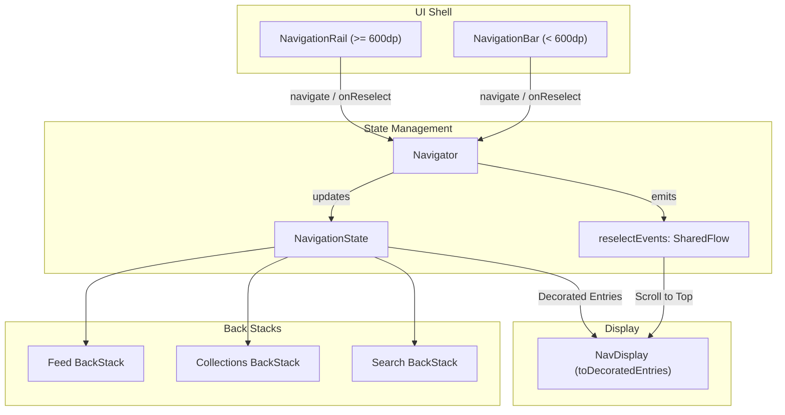

# Specification: Android Navigation 3 Multiple Back Stacks & Navigator Architecture

**Status:** Implemented

## 1. Overview & Objectives

In the current Android implementation, all navigation history is crammed into a single, mutable `NavBackStack<NavKey>` created via `rememberNavBackStack(Screen.Feed)`. Top-level tab switching (`Feed`, `Collections`, `Search`) is orchestrated through a fragile, hand-rolled indexing algorithm in `MainActivity.kt` (lines 185–211):
```kotlin
val navigateToTab = { targetScreen: Screen ->
    if (targetScreen is Screen.Feed) {
        while (backStackState.size > 1) backStackState.removeAt(backStackState.size - 1)
    } else {
        val targetIndex = backStackState.indexOfFirst { ... }
        // Truncates or replaces stack entries at index 1...
    }
}
```
This architecture creates several critical UX and structural defects:
1. **Destruction of Tab History:** Switching from Search (with active results) to Collections and back to Search truncates the stack, completely discarding prior search results and scroll positions.
2. **Tab Visibility Glitches:** Shell chrome visibility (`useRail` / `useBottomBar`) is evaluated against `backStackState.lastOrNull()`. When a user navigates to a search tag from Photo Details (`Screen.Search(query = tag)`), the app mistakenly displays the bottom navigation bar inside the detail flow.
3. **Monolithic MainActivity Boilerplate:** Navigation bar and rail items are copied verbatim across 120 lines of repetitive UI code. Additionally, all routing is lumped into a 170-line manual `when (navKey as Screen)` statement in `MainActivity.kt` rather than using the modular `entryProvider` DSL.
4. **State Leaking & Un-testability:** The active back stack is assigned to an activity field (`private var backStack: NavBackStack<NavKey>?`) so that the hardware shake detector can push random photo details, bypassing composition and preventing isolated unit testing.

This specification details the plan to migrate to the canonical **Multiple Back Stacks** pattern from the Google Android Navigation 3 recipe, introducing a decoupled `Navigator`, dedicated `NavigationState`, modular `entryProvider` extensions, and a comprehensive JVM unit test suite.

---

## 2. Technical Architecture & Component Specifications



### A. Dedicated Route Definitions (`Routes.kt`)
Extract route keys from `MainActivity.kt` into `com.example.imagefeed.android.navigation.Routes.kt`:
```kotlin
package com.example.imagefeed.android.navigation

import androidx.compose.material.icons.Icons
import androidx.compose.material.icons.automirrored.filled.List
import androidx.compose.material.icons.filled.Home
import androidx.compose.material.icons.filled.Search
import androidx.compose.ui.graphics.vector.ImageVector
import androidx.navigation3.runtime.NavKey
import kotlinx.serialization.Serializable

@Serializable
sealed interface AppRoute : NavKey {
    @Serializable
    data object Feed : AppRoute

    @Serializable
    data object Collections : AppRoute

    @Serializable
    data class CollectionDetails(val collectionId: String) : AppRoute

    @Serializable
    data class Search(val query: String = "") : AppRoute

    @Serializable
    data class PhotoDetails(val photoId: String) : AppRoute

    @Serializable
    data class UserProfile(val username: String) : AppRoute
}

data class TopLevelDestination(
    val route: AppRoute,
    val icon: ImageVector,
    val label: String
)

val TOP_LEVEL_DESTINATIONS = listOf(
    TopLevelDestination(AppRoute.Feed, Icons.Default.Home, "Photos"),
    TopLevelDestination(AppRoute.Collections, Icons.AutoMirrored.Filled.List, "Collections"),
    TopLevelDestination(AppRoute.Search(), Icons.Default.Search, "Search")
)
```

### B. Persistent Multi-Stack Navigation State (`NavigationState.kt`)
Following the Navigation 3 multiple back stacks recipe:
```kotlin
package com.example.imagefeed.android.navigation

import androidx.compose.runtime.Composable
import androidx.compose.runtime.MutableState
import androidx.compose.runtime.getValue
import androidx.compose.runtime.mutableStateOf
import androidx.compose.runtime.remember
import androidx.compose.runtime.saveable.rememberSerializable
import androidx.compose.runtime.setValue
import androidx.lifecycle.viewmodel.navigation3.rememberViewModelStoreNavEntryDecorator
import androidx.navigation3.runtime.NavBackStack
import androidx.navigation3.runtime.NavEntry
import androidx.navigation3.runtime.NavKey
import androidx.navigation3.runtime.rememberDecoratedNavEntries
import androidx.navigation3.runtime.rememberNavBackStack
import androidx.navigation3.runtime.rememberSaveableStateHolderNavEntryDecorator
import androidx.navigation3.runtime.serialization.NavKeySerializer
import androidx.savedstate.compose.serialization.serializers.MutableStateSerializer

@Composable
fun rememberAppNavigationState(
    startRoute: AppRoute = AppRoute.Feed,
    topLevelRoutes: Set<AppRoute> = setOf(AppRoute.Feed, AppRoute.Collections, AppRoute.Search())
): NavigationState {
    val topLevelRoute = rememberSerializable(
        startRoute, topLevelRoutes,
        serializer = MutableStateSerializer(NavKeySerializer())
    ) {
        mutableStateOf(startRoute)
    }

    val backStacks = topLevelRoutes.associateWith { key ->
        rememberNavBackStack(key)
    }

    return remember(startRoute, topLevelRoutes) {
        NavigationState(
            startRoute = startRoute,
            topLevelRouteState = topLevelRoute,
            backStacks = backStacks
        )
    }
}

class NavigationState(
    val startRoute: AppRoute,
    private val topLevelRouteState: MutableState<AppRoute>,
    val backStacks: Map<AppRoute, NavBackStack<NavKey>>
) {
    var topLevelRoute: AppRoute by topLevelRouteState

    @Composable
    fun toDecoratedEntries(
        entryProvider: (NavKey) -> NavEntry<NavKey>
    ): List<NavEntry<NavKey>> {
        val decoratedEntries = backStacks.mapValues { (_, stack) ->
            val decorators = listOf(
                rememberSaveableStateHolderNavEntryDecorator<NavKey>(),
                rememberViewModelStoreNavEntryDecorator<NavKey>()
            )
            rememberDecoratedNavEntries(
                backStack = stack,
                entryDecorators = decorators,
                entryProvider = entryProvider
            )
        }

        // Return entries for active stacks using the "Exit Through Home" pattern
        return getTopLevelRoutesInUse().flatMap { decoratedEntries[it] ?: emptyList() }
    }

    fun getTopLevelRoutesInUse(): List<AppRoute> =
        if (topLevelRoute == startRoute) {
            listOf(startRoute)
        } else {
            listOf(startRoute, topLevelRoute)
        }
}
```

### C. Decoupled Navigator Controller (`Navigator.kt`)
Manages navigation events, back navigation logic, and tab reselection signals:
```kotlin
package com.example.imagefeed.android.navigation

import androidx.navigation3.runtime.NavKey
import kotlinx.coroutines.flow.MutableSharedFlow
import kotlinx.coroutines.flow.asSharedFlow

class Navigator(val state: NavigationState) {
    private val _reselectEvents = MutableSharedFlow<NavKey>(extraBufferCapacity = 1)
    val reselectEvents = _reselectEvents.asSharedFlow()

    fun navigate(route: NavKey) {
        val matchingTopLevel = state.backStacks.keys.firstOrNull { it::class == route::class }
        if (matchingTopLevel != null) {
            // Switch to top level route
            state.topLevelRoute = matchingTopLevel
        } else {
            // Push sub-route onto current top-level back stack
            state.backStacks[state.topLevelRoute]?.add(route)
        }
    }

    fun onReselect(route: NavKey) {
        _reselectEvents.tryEmit(route)
    }

    fun goBack(): Boolean {
        val currentStack = state.backStacks[state.topLevelRoute] ?: return false
        val currentRoute = currentStack.lastOrNull()

        return if (currentRoute == state.topLevelRoute) {
            if (state.topLevelRoute != state.startRoute) {
                state.topLevelRoute = state.startRoute
                true
            } else {
                false // At the root of startRoute; delegate to system/activity exit
            }
        } else {
            currentStack.removeLastOrNull()
            true
        }
    }
}
```

### D. Tab Reselect Scroll-to-Top Integration
When a user reselects the active tab in the `NavigationBar` or `NavigationRail`, `Navigator.onReselect(route)` signals the event via `reselectEvents`.
- `FeedScreen`: Observes `reselectEvents` for `AppRoute.Feed` and executes `listState.animateScrollToItem(0)`.
- `CollectionsFeedScreen`: Observes `reselectEvents` for `AppRoute.Collections` and executes `listState.animateScrollToItem(0)`.
- `SearchScreen`: Observes `reselectEvents` for `AppRoute.Search` and executes `listState.animateScrollToItem(0)`.

### E. Entry Provider DSL & Feature Section Extensions
Decompose `MainActivity.kt`'s massive inline entry block into clean, isolated extensions:
- `NavigationSections.kt`:
  ```kotlin
  fun EntryProviderScope<NavKey>.feedSection(
      sharedTransitionScope: SharedTransitionScope,
      navigator: Navigator,
      onRandomClick: () -> Unit
  ) {
      entry<AppRoute.Feed> {
          FeedScreen(
              sharedTransitionScope = sharedTransitionScope,
              animatedVisibilityScope = LocalNavAnimatedContentScope.current,
              presenter = rememberEntryPresenter(key = "feed") { MetroHelper.getFeedPresenter() },
              reselectEvents = navigator.reselectEvents,
              onPhotoClick = dropUnlessResumed { photo -> navigator.navigate(AppRoute.PhotoDetails(photo.id)) },
              onUserClick = dropUnlessResumed { user -> navigator.navigate(AppRoute.UserProfile(user.username)) },
              onSearchClick = dropUnlessResumed { navigator.navigate(AppRoute.Search()) },
              onRandomClick = onRandomClick
          )
      }
  }
  ```
  Corresponding sections are implemented for `collectionsSection`, `searchSection`, `photoDetailsSection`, and `userProfileSection`.

### F. Elimination of Activity Field Leakage
The shake sensor detector (`handleShake()`) will invoke `navigator.navigate(AppRoute.PhotoDetails(randomPhoto.id))` directly from a callback lambda passed to `MainActivityContent`, eliminating the nullable `private var backStack` field in `MainActivity`.

---

## 3. Implementation Plan & Execution Checklist

- [x] **Phase 1: Architecture Foundation**
  - [x] Create `com.example.imagefeed.android.navigation.Routes.kt` with strongly typed `AppRoute` hierarchy and `TOP_LEVEL_DESTINATIONS`.
  - [x] Create `NavigationState.kt` with `rememberAppNavigationState` and per-stack decorated entry providers.
  - [x] Create `Navigator.kt` with `navigate`, `goBack`, `onReselect`, and `reselectEvents`.

- [x] **Phase 2: Feature Section Modularization**
  - [x] Implement `EntryProviderScope<NavKey>` extensions for `feedSection`, `collectionsSection`, `searchSection`, `photoDetailsSection`, and `userProfileSection`.
  - [x] Wire `reselectEvents` into `FeedScreen`, `CollectionsFeedScreen`, and `SearchScreen` for scroll-to-top interaction.

- [x] **Phase 3: Chrome & Shell Modernization in `MainActivity.kt`**
  - [x] Replace hand-rolled tab items in `NavigationRail` and `NavigationBar` with loops over `TOP_LEVEL_DESTINATIONS`.
  - [x] Bind selected tab state strictly to `navigationState.topLevelRoute`.
  - [x] Display navigation shell based on whether the active tab's stack is at root or has sub-routes.
  - [x] Connect `NavDisplay` to `navigationState.toDecoratedEntries(entryProvider)` and `onBack = { navigator.goBack() }`.
  - [x] Remove `private var backStack` field and wire shake action directly to `navigator`.

- [x] **Phase 4: Unit Test Suite (`androidApp/src/test`)**
  - [x] Create `NavigatorTest.kt` in `androidApp/src/test/java/com/example/imagefeed/android/navigation/NavigatorTest.kt`.
  - [x] Test tab switching between Feed, Collections, and Search.
  - [x] Test pushing sub-routes onto individual stacks without leaking into sibling stacks.
  - [x] Test "Exit Through Home" back navigation semantics.
  - [x] Test reselect event emission.

- [x] **Phase 5: Verification & Zero Warnings**
  - [x] Run `./gradlew :androidApp:testDebugUnitTest`.
  - [x] Run `./gradlew ktlintCheck detekt`.
  - [x] Run `./gradlew :androidApp:compileDebugKotlin`.
  - [x] Run `./gradlew :androidApp:assembleDebug`.
