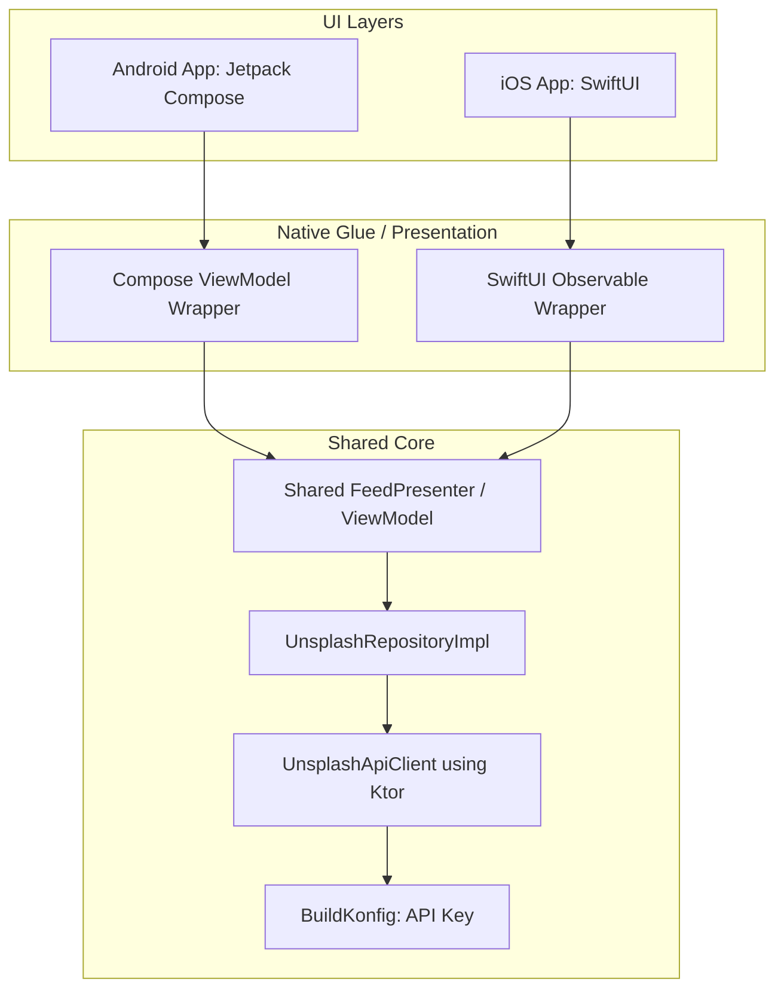

# Kotlin Multiplatform Unsplash Image Feed App

A plan to build a high-performance, modern, and adaptive mobile application utilizing Kotlin Multiplatform (KMP) for shared business logic, data models, networking, and presentation state management, combined with fully native user interfaces: Jetpack Compose for Android and SwiftUI for iOS.

This document describes the final architectural decisions, integration patterns, and step-by-step implementation phases.

---

## Final Project Decisions & Decisions Made

Based on feedback, the following core decisions are adopted for the project:
1.  **API Key Management:** The Unsplash Access Key will **not** be stored in source code. It will be loaded at build time from a `local.properties` file using the **BuildKonfig** plugin in KMP, exposing it securely to the shared Kotlin code.
2.  **Shared vs. Native ViewModels:** We will use **Shared Presenters/StateHolders** in the `shared` module. This encapsulates all loading, refreshing, pagination, and error handling states in Kotlin, exposing a clean `StateFlow<FeedState>` to the UI.
    *   **Android:** Jetpack Compose will observe the shared flow natively with lifecycle awareness.
    *   **iOS:** SwiftUI (iOS 17+) will observe the flow using a thin Swift ViewModel helper that maps flow emissions to native `@Observable` properties, keeping iOS view code extremely clean.
3.  **Offline Caching:** **Omitted for the first iteration** to simplify scope. However, the data architecture will use an `UnsplashRepository` interface so that an offline database (SQLDelight/Room) can be seamlessly integrated later without changing the presentation layer.
4.  **Target Versions:** Targeting modern SDKs to leverage modern framework features:
    *   **Android:** Minimum SDK `29` (Android 10.0), Target SDK `34` (Android 14.0).
    *   **iOS:** Minimum iOS `17.0` (leveraging Swift 5.9, `@Observable` macros, and advanced SwiftUI features).

---

## Technical Stack & Libraries

### Shared Core (`shared` module)
*   **Networking:** Ktor Client with ContentNegotiation.
*   **Serialization:** Kotlinx Serialization for JSON parsing.
*   **Concurrency:** Kotlin Coroutines and Flows for state streaming.
*   **Build Config:** [BuildKonfig](https://github.com/yshrsmz/BuildKonfig) to inject the API Access Key from Gradle properties.
*   **Dependency Injection:** Koin for dependency management.

### Android Application (`androidApp` module)
*   **UI Framework:** Jetpack Compose (using Material 3 styling).
*   **Image Loading:** Coil 3 (KMP-compatible or Android native) with memory and disk caching.
*   **Concurreny helpers:** `lifecycle-runtime-compose` to safely collect flows with lifecycle awareness.

### iOS Application (`iosApp` module)
*   **UI Framework:** SwiftUI (iOS 17+).
*   **Image Loading:** Kingfisher for caching, performance, and custom fade transitions.
*   **Bridge layer:** Custom Swift class observing the shared presenter's state flow.

---

## Architecture Design



### Shared Presenter Pattern
We will implement a `FeedPresenter` in the shared module:

```kotlin
data class FeedState(
    val photos: List<Photo> = emptyList(),
    val isLoading: Boolean = false,
    val isRefreshing: Boolean = false,
    val error: String? = null,
    val hasReachedEnd: Boolean = false
)

class FeedPresenter(private val repository: UnsplashRepository) {
    private val _state = MutableStateFlow(FeedState())
    val state: StateFlow<FeedState> = _state.asStateFlow()
    
    fun loadNextPage() { ... }
    fun refresh() { ... }
}
```

On iOS, we wrap this in Swift to integrate seamlessly with SwiftUI:
```swift
@Observable
class SwiftUIFeedViewModel {
    private let presenter: FeedPresenter
    var state = FeedState()
    
    init(presenter: FeedPresenter) {
        self.presenter = presenter
        // Observe presenter.state flow and update self.state on main actor
    }
}
```

---

## UI/UX & Fluidity Guidelines

1.  **Adaptive Staggered Grid:**
    *   **Compose:** Use `LazyVerticalStaggeredGrid` with custom card layouts.
    *   **SwiftUI:** Use a custom 2-column staggered grid (since SwiftUI's built-in grid is uniform).
2.  **BlurHash Placeholders:**
    *   We will parse the `blur_hash` string returned by the API.
    *   On Android, we can decode the BlurHash using a Kotlin/JVM helper and load it via Coil.
    *   On iOS, we can decode the BlurHash using a Swift helper and load it as a placeholder image in Kingfisher.
3.  **Dynamic Image Sizing:**
    *   Request URLs appended with exact screen size: `?w=\(width)&q=80&auto=format` to avoid downloading full-size images (improving scroll performance and reducing RAM footprint).
4.  **Transitions & Gestures:**
    *   Feed card list entrance animations (fade-in, slide-up).
    *   Smooth visual changes when loading more or pull-to-refresh.

---

## Project Structure

We will generate a modern KMP project with this workspace structure:
```
image-feed-app/
├── gradle/
├── build.gradle.kts
├── settings.gradle.kts
├── local.properties          # Excluded from git. Holds unsplashApiKey
├── gradle.properties
├── specs/                    # Specifications folder
│   ├── implementation_plan.md
│   └── steps.md
├── shared/                   # Kotlin Multiplatform core module
│   ├── build.gradle.kts
│   └── src/
│       ├── commonMain/       # Shared logic, Ktor, Presenters
│       ├── androidMain/      # Android-specific shared configurations
│       └── iosMain/          # iOS-specific framework target setup
├── androidApp/               # Native Android application
│   ├── build.gradle.kts
│   └── src/                  # Compose UI screens
└── iosApp/                   # Xcode project for SwiftUI
    ├── iosApp.xcodeproj
    └── iosApp/               # SwiftUI views and view models
```

---

## Step-by-Step Execution Plan

### Phase 1: Environment Diagnostics & Workspace Setup
1. Verify KMP tools (JDK, Android SDK, Kotlin, Xcode if available).
2. Create directories, Gradle files, and standard configuration templates.
3. Add `local.properties` and configure BuildKonfig to inject the placeholder.

### Phase 2: Shared Module Implementation
1. Configure dependencies in `shared/build.gradle.kts` (Ktor, Serialization, Coroutines, BuildKonfig, Koin).
2. Define API Models matching the Unsplash JSON response structure.
3. Implement `UnsplashApiClient` with pagination query mapping and client headers.
4. Implement `UnsplashRepository` and interface layout.
5. Create the shared `FeedPresenter` with Flow-based state emission.

### Phase 3: Android App Implementation
1. Set up `androidApp/build.gradle.kts` with Jetpack Compose dependencies.
2. Build Android DI configuration (Koin).
3. Implement standard Android ViewModel bridging to the shared presenter.
4. Build Compose UI screens (Adaptive Staggered Grid, Photographer Credit Cards).
5. Add Coil integration for image loading, cross-fades, and BlurHash placeholder decoding.

### Phase 4: iOS App Implementation
1. Add target setups for iOS framework output in the KMP gradle script.
2. Build SwiftUI presentation wrapper supporting Swift Concurrency / flows.
3. Implement SwiftUI views using native grid layouts.
4. Integrate Kingfisher for SwiftUI to stream and cache Unsplash photos.

### Phase 5: Verification & Walkthrough
1. Build both projects.
2. Verify image loading, infinite pagination triggers, rate-limit failure recovery, and responsiveness.

### Phase 6: Tablet & iPad Adaptive Multi-Column Layouts
1. Android App: Replace hardcoded `StaggeredGridCells.Fixed(2)` with adaptive calculations using screen-width Dp, and build side-by-side Row split detail views on screens >600dp.
2. iOS App: Replace rigid 2-column divisions with size-class based dynamic N-column rendering, and configure iPadOS NavigationSplitView master-detail panels.
